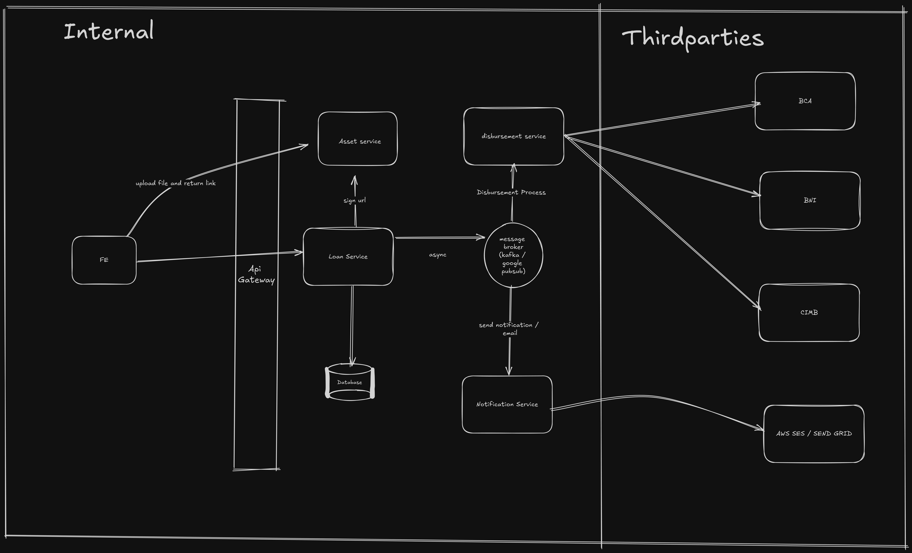
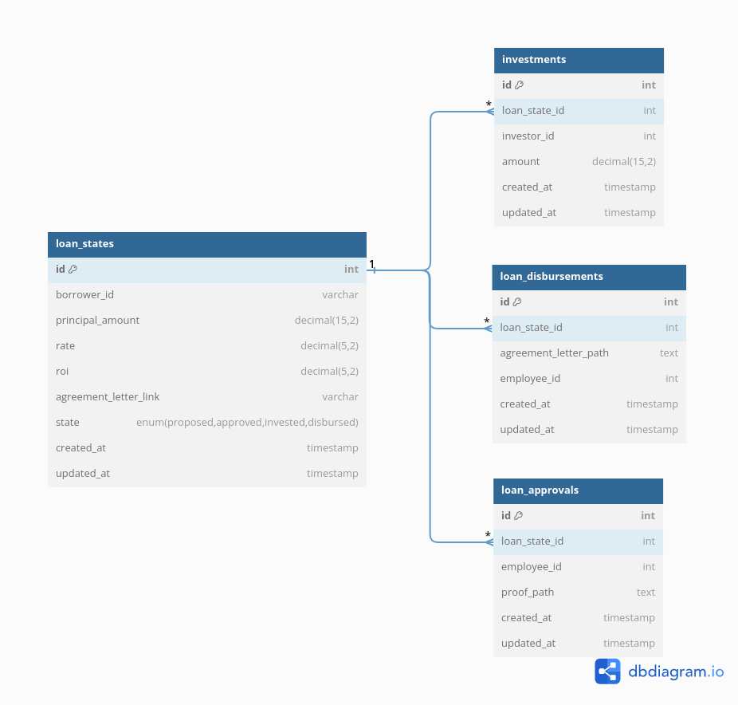

# Loan Engine API Design and Database Schema


## API Design




### 1. Create Loan

**Endpoint**: `POST api/v1/loan/create`

**Description**: Create a new loan with an initial state of `proposed`.

**Request Body**:

```json
{
  "borrower_id": 1,
  "principal_amount": 1000000,
  "rate": 0.1,
  "roi": 0.2
}
```
### Response:

- **201 Created**: Returns the created loan with initial state `proposed`.
- **400 Bad Request**: If validation fails.


### 2. Approve Loan
**Endpoint**: `POST api/v1/loan/{id}/approve`

**Description**: Approve a loan, transitioning it to the `approved` state.

**Request Body**:

```json
{
  "proof_path": "https://bucket/proof_path.png", 
  "employee_id": "string",
  "approval_date": "YYYY-MM-DD"
}

```
### Response:

- **200 OK**: Returns the updated loan with state `approved`.
- **400 Bad Request**: If the loan is already approved or if the required information is missing.
- **404 Not Found**: If the loan does not exist.

### 3. Invest in Loan
**Endpoint**: `POST api/v1/loan/{id}/invest`

**Description**: Invest in a loan, transitioning it to the invested state once the total `invested` amount equals the principal.

**Request Body**:

```json
{
    "investor_id": 1,
    "amount": 500000
}

```
### Response:
- **200 OK**: Returns the updated loan with state `invested` and sends investment agreement emails.
- **400 Bad Request**: If the total investment exceeds the principal or if the loan is not in the `approved` state.
- **404 Not Found**: If the loan does not exist.

### 4. Disburse Loan
**Endpoint**: `POST api/v1/loan/{id}/disburse`

**Description**: Disburse the loan, transitioning it to the `disbursed` state.

**Request Body**:

```json
{
  "borrower_agreement_letter_path": "https://bucket/agreement_letter.pdf", 
  "employee_id": 1
}

```
### Response:
- **200 OK**: Returns the updated loan with state `disbursed`.
- **400 Bad Request**:  If the loan is not in the `invested` state or if the required information is missing.
- **404 Not Found**: If the loan does not exist.

### 5. Loan Detail
**Endpoint**: `POST api/v1/loan/{id}/detail`

**Description**: Retrieve the details of a loan, including its current state and associated information.

**Request Body**:
- **200 OK**: Returns the loan details.
- **404 Not Found**: If the loan does not exist.


# Database Schema

## Database Diagram Design

## Tables

### `loan_states`

This table tracks the state of each loan.

| Column                   | Type          | Description                                                            |
|--------------------------|---------------|------------------------------------------------------------------------|
| `id`                     | INT           | Primary key, auto-incremented.                                         |
| `borrower_id`            | VARCHAR(255)  | Identifier for the borrower.                                           |
| `principal_amount`       | DECIMAL(15,2) | The principal amount of the loan.                                      |
| `rate`                   | DECIMAL(5,2)  | The interest rate of the loan.                                         |
| `roi`                    | DECIMAL(5,2)  | Return on investment.                                                  |
| `state`                  | ENUM          | Current state of the loan (proposed, approved, invested, disbursed).   |
| `created_at`             | TIMESTAMP     | Timestamp when the record was created.                                 |
| `updated_at`             | TIMESTAMP     | Timestamp when the record was last updated.                            |

**Notes:**
- Movement between states is forward only (e.g., proposed → approved → invested → disbursed).
- Implement validation for each state transition to prevent incorrect state changes.
- Set up email notifications for investors when a loan transitions to the invested state.

### `loan_approvals`

This table logs the approval details for each loan.

| Column            | Type      | Description                                         |
|-------------------|-----------|-----------------------------------------------------|
| `id`              | INT       | Primary key, auto-incremented.                      |
| `loan_state_id`   | INT       | Foreign key referencing `loan_states.id`.           |
| `employee_id`     | INT       | ID of the field validator.                          |
| `proof_path`      | TEXT      | Path to the proof of validation.                    |
| `created_at`      | TIMESTAMP | Timestamp when the record was created.              |
| `updated_at`      | TIMESTAMP | Timestamp when the record was last updated.         |

### `investments`

This table records the investments made in loans.

| Column                                | Type          | Description                                   |
|---------------------------------------|---------------|-----------------------------------------------|
| `id`                                  | INT           | Primary key, auto-incremented.                |
| `loan_state_id`                       | INT           | Foreign key referencing `loan_states.id`.     |
| `investor_id`                         | INT           | ID of the investor.                           |
| `investor_agreement_letter_path`      | TEXT          | investor agreement letter.                    |
| `amount`                              | DECIMAL(15,2) | The amount invested.                          |
| `created_at`                          | TIMESTAMP     | Timestamp when the record was created.        |
| `updated_at`                          | TIMESTAMP     | Timestamp when the record was last updated.   |

### `loan_disbursements`

This table tracks the disbursements of loans.

| Column                            | Type      | Description                                 |
|-----------------------------------|-----------|---------------------------------------------|
| `id`                              | INT       | Primary key, auto-incremented.              |
| `loan_state_id`                   | INT       | Foreign key referencing `loan_states.id`.   |
| `borrower_agreement_letter_path`  | TEXT      | Borrower agreement letter.                  |
| `employee_id`                     | INT       | ID of the field officer.                    |
| `created_at`                      | TIMESTAMP | Timestamp when the record was created.      |
| `updated_at`                      | TIMESTAMP | Timestamp when the record was last updated. |
